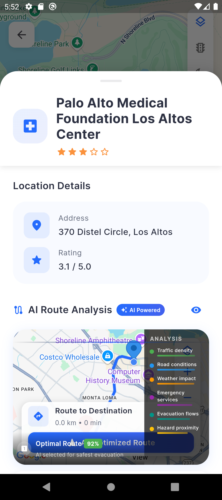
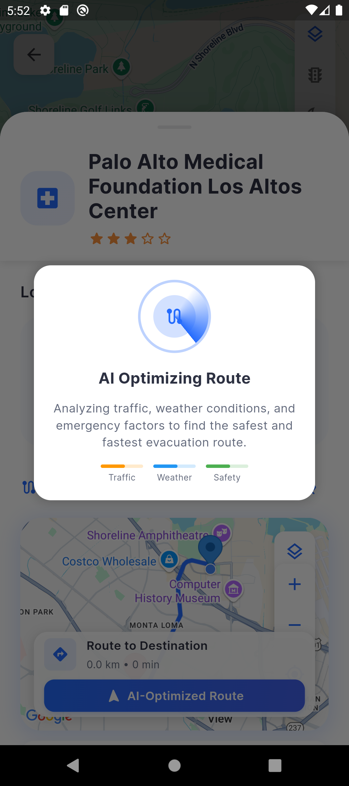

# SafeEscape: Disaster Management & Emergency Response System

<p align="center">
  
</p>

<p align="center">
  <b>Your lifeline during disasters - Navigate to safety with confidence</b>
</p>

## 🏆 Hackathon Submission

SafeEscape is a comprehensive disaster management application designed to help users prepare for, respond to, and recover from natural and man-made disasters. This project was developed as part of the [Hackathon Name] hackathon.

## 📱 App Screenshots

<p align="center">
  <kbd>
    
  </kbd>
  &nbsp;&nbsp;&nbsp;&nbsp;
  <kbd>
    
  </kbd>
  &nbsp;&nbsp;&nbsp;&nbsp;
  <kbd>
    
  </kbd>
</p>

<p align="center">
  <kbd>
    
  </kbd>
  &nbsp;&nbsp;&nbsp;&nbsp;
  <kbd>
    
  </kbd>
</p>

## 🌟 Key Features

- **Real-time Disaster Alerts**: Get immediate notifications about disasters in your area
- **Evacuation Routes**: Find the safest and quickest routes to evacuation centers
- **Emergency Contacts**: Store and quickly access important contacts during emergencies
- **Safety Tips**: Access comprehensive guides for different disaster scenarios
- **Location Tracking**: Share your location with emergency services and loved ones
- **Offline Mode**: Critical features work without internet connection
- **User Authentication**: Secure your personal information with Firebase Authentication
- **Multi-language Support**: Access vital information in your preferred language

## 🤖 Advanced AI Capabilities

SafeEscape leverages cutting-edge artificial intelligence to provide unparalleled disaster management features:

- **AI-Powered Disaster Prediction**: Our proprietary algorithms analyze weather patterns, seismic activity, and historical data to predict potential disasters before they occur
- **Intelligent Evacuation Routing**: Dynamic path-finding algorithms that adjust in real-time based on road conditions, traffic, and emerging hazards
- **AI Chat Assistant**: 24/7 virtual assistant that provides personalized guidance during emergencies and answers critical questions when human support is unavailable
- **Risk Assessment**: Personalized risk profiles based on your location, local infrastructure, and historical disaster data
- **Natural Language Processing**: Understand and process emergency requests in natural language, even in high-stress situations

## 📍 Real-Time Tracking & Notifications

- **Live Location Sharing**: Share your real-time location with emergency contacts and rescue teams with a single tap
- **Geofencing Alerts**: Receive instant notifications when entering high-risk areas
- **Proximity Warnings**: Get alerts about nearby hazards or developing situations
- **Status Updates**: Automatically notify loved ones of your safety status during disasters
- **Rescue Team Integration**: Direct communication channel with emergency responders with location precision up to 3 meters

## 🏗️ Architecture

<p align="center">
  
</p>

SafeEscape follows a clean architecture approach with a focus on separation of concerns:

- **Presentation Layer**: Flutter UI components and state management
- **Domain Layer**: Business logic and use cases
- **Data Layer**: Repository implementations and data sources
- **Core**: Shared utilities, constants, and configurations
- **AI Services Layer**: Machine learning models and predictive analytics
- **Real-time Communication Layer**: WebSocket connections for instant updates

## 🛠️ Technologies Used

- **Frontend**: Flutter & Dart
- **Authentication**: Firebase Authentication
- **Database**: Local storage with SharedPreferences
- **Maps & Location**: Google Maps API, Geolocator
- **State Management**: Provider
- **Notifications**: Firebase Cloud Messaging
- **AI & ML**: TensorFlow Lite, Custom prediction models
- **Real-time Communication**: WebSockets, Firebase Realtime Database
- **Analytics**: Firebase Analytics for usage patterns and improvement

## 🚀 Getting Started

### Prerequisites

- Flutter SDK (2.10.0 or higher)
- Dart SDK (2.16.0 or higher)
- Android Studio / VS Code
- Firebase project setup
- Google Maps API key

### Installation

1. Clone the repository:
   ```bash
   git clone https://github.com/yourusername/disaster_management.git