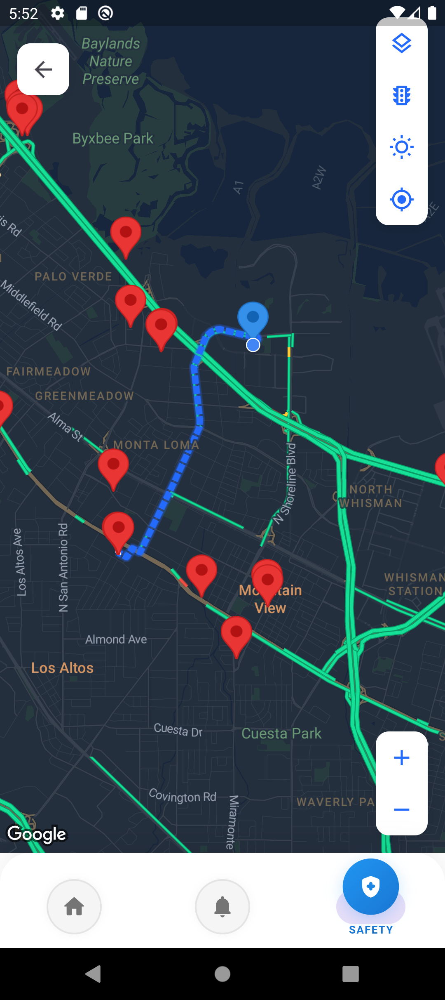
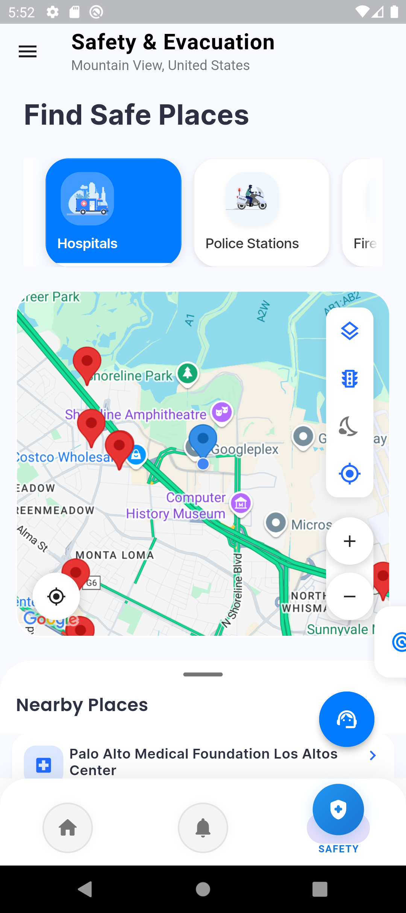

# SafeEscape: Disaster Management & Emergency Response System

<div align="center">
  
  <h3>Your lifeline during disasters - Navigate to safety with confidence</h3>
  <p>
    <a href="#features"></a>
    <a href="#license"></a>
    <a href="#installation"></a>
    <a href="#team-members"></a>
  </p>
</div>

## 🏆 Hackathon Submission

SafeEscape is a comprehensive disaster management application designed to help users prepare for, respond to, and recover from natural and man-made disasters. This project was developed as part of the [Hackathon Name] hackathon.

## 📱 App Screenshots

<div align="center">
  <table>
    <tr>
      <td align="center"><br><b>Home Dashboard</b></td>
      <td align="center"><br><b>Evacuation Routes</b></td>
      <td align="center"><br><b>Emergency Contacts</b></td>
    </tr>
    <tr>
      <td align="center"><br><b>Disaster Alerts</b></td>
      <td align="center"><br><b>Safety Tips</b></td>
      <td align="center"><br><b>AI Assistant</b></td>
    </tr>
    <tr>
      <td align="center"><br><b>User Profile</b></td>
      <td align="center"><br><b>Disaster Map</b></td>
      <td align="center"><br><b>Emergency Resources</b></td>
    </tr>
  </table>
</div>

## 🌟 Key Features

<table>
  <tr>
    <td width="50%">
      <h3>🔔 Real-time Disaster Alerts</h3>
      <p>Get immediate notifications about disasters in your area with severity levels and recommended actions.</p>
    </td>
    <td width="50%">
      <h3>🗺️ Evacuation Routes</h3>
      <p>Find the safest and quickest routes to evacuation centers with real-time traffic updates.</p>
    </td>
  </tr>
  <tr>
    <td width="50%">
      <h3>📞 Emergency Contacts</h3>
      <p>Store and quickly access important contacts during emergencies with one-tap calling.</p>
    </td>
    <td width="50%">
      <h3>📋 Safety Tips</h3>
      <p>Access comprehensive guides for different disaster scenarios, customized to your location.</p>
    </td>
  </tr>
  <tr>
    <td width="50%">
      <h3>📍 Location Tracking</h3>
      <p>Share your location with emergency services and loved ones with precision up to 3 meters.</p>
    </td>
    <td width="50%">
      <h3>📵 Offline Mode</h3>
      <p>Critical features work without internet connection, ensuring help when you need it most.</p>
    </td>
  </tr>
</table>

## 🤖 Advanced AI Capabilities

SafeEscape leverages cutting-edge artificial intelligence to provide unparalleled disaster management features:

<div align="center">
  
</div>

- **AI-Powered Disaster Prediction**: Our proprietary algorithms analyze weather patterns, seismic activity, and historical data to predict potential disasters before they occur
- **Intelligent Evacuation Routing**: Dynamic path-finding algorithms that adjust in real-time based on road conditions, traffic, and emerging hazards
- **AI Chat Assistant**: 24/7 virtual assistant that provides personalized guidance during emergencies and answers critical questions when human support is unavailable
- **Risk Assessment**: Personalized risk profiles based on your location, local infrastructure, and historical disaster data
- **Natural Language Processing**: Understand and process emergency requests in natural language, even in high-stress situations

## 📍 Real-Time Tracking & Notifications

<div align="center">
  
</div>

- **Live Location Sharing**: Share your real-time location with emergency contacts and rescue teams with a single tap
- **Geofencing Alerts**: Receive instant notifications when entering high-risk areas
- **Proximity Warnings**: Get alerts about nearby hazards or developing situations
- **Status Updates**: Automatically notify loved ones of your safety status during disasters
- **Rescue Team Integration**: Direct communication channel with emergency responders with location precision up to 3 meters

## 🏗️ Architecture

<p align="center">
  
</p>

SafeEscape follows a clean architecture approach with a focus on separation of concerns:

<div align="center">
  <table>
    <tr>
      <td align="center"><b>Presentation Layer</b><br>Flutter UI components and state management</td>
      <td align="center"><b>Domain Layer</b><br>Business logic and use cases</td>
    </tr>
    <tr>
      <td align="center"><b>Data Layer</b><br>Repository implementations and data sources</td>
      <td align="center"><b>Core</b><br>Shared utilities, constants, and configurations</td>
    </tr>
    <tr>
      <td align="center"><b>AI Services Layer</b><br>Machine learning models and predictive analytics</td>
      <td align="center"><b>Real-time Communication Layer</b><br>WebSocket connections for instant updates</td>
    </tr>
  </table>
</div>

## 🛠️ Technologies Used

<div align="center">
  
  
  
  
  
</div>

<table>
  <tr>
    <td width="33%"><b>Frontend</b><br>Flutter & Dart</td>
    <td width="33%"><b>Authentication</b><br>Firebase Authentication</td>
    <td width="33%"><b>Database</b><br>SharedPreferences</td>
  </tr>
  <tr>
    <td width="33%"><b>Maps & Location</b><br>Google Maps API, Geolocator</td>
    <td width="33%"><b>State Management</b><br>Provider</td>
    <td width="33%"><b>Notifications</b><br>Firebase Cloud Messaging</td>
  </tr>
  <tr>
    <td width="33%"><b>AI & ML</b><br>TensorFlow Lite, Custom models</td>
    <td width="33%"><b>Real-time Communication</b><br>WebSockets, Firebase Realtime DB</td>
    <td width="33%"><b>Analytics</b><br>Firebase Analytics</td>
  </tr>
</table>

## 🚀 Getting Started

### Prerequisites

<table>
  <tr>
    <td></td>
    <td>Flutter SDK (2.10.0 or higher)</td>
  </tr>
  <tr>
    <td></td>
    <td>Dart SDK (2.16.0 or higher)</td>
  </tr>
  <tr>
    <td></td>
    <td>Android Studio / VS Code</td>
  </tr>
  <tr>
    <td></td>
    <td>Firebase project setup</td>
  </tr>
  <tr>
    <td></td>
    <td>Google Maps API key</td>
  </tr>
</table>

### Installation

1. Clone the repository:
   ```bash
   git clone https://github.com/yourusername/disaster_management.git